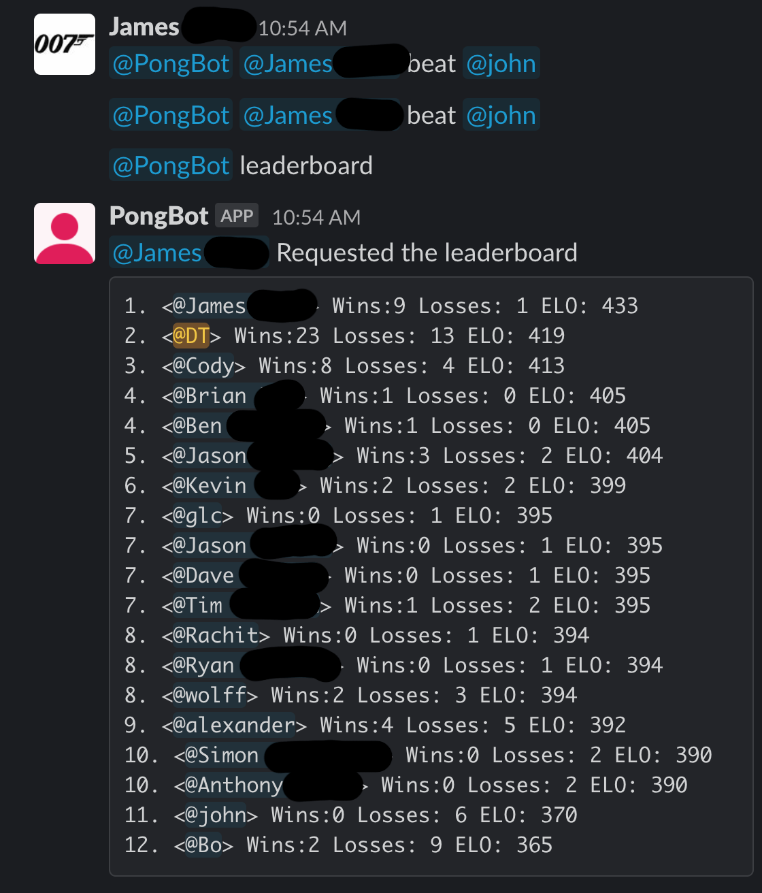

# Super Simple Office PingPong Slack Bot
Hey there are other options, but I want a slack bot that does not store any PII. 
This only stores slack user ids so no risk to your organization. 


## To run in dev 

install [ngrok](https://ngrok.com/)
```
ngrok http 8080
```

```
./init.sh

source .venv/bin/activate
```

```
pip install -r req.txt
```

``` 
export SLACK_VERFICATION_KEY="<YOUR_SLACK_KEY>"
export SLACK_CLEINT_TOKEN="<YOUR_SLACK_CLIENT_TOKEN>"
export MYSQL_HOST="<YOUR_SQL_HOST>"
export MYSQL_USER="<YOUR_SQL_USER>"
export MYSQL_PASSWORD="<YOUR_SQL_PASSWORD>" 

python main.py 
```

## To Deploy


## Don't Want to Host, Install Here
coming soon (for a reasonable price)